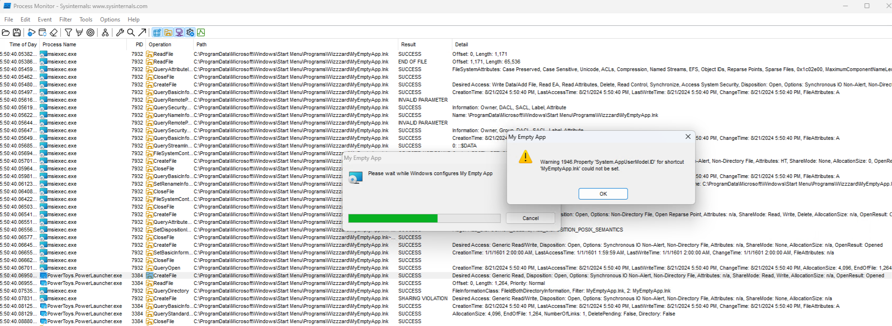

# How to build

- Open MyEmptyApp.sln in Visual Studio.
- Select release configuration
  - Build
  - This will create x64\Release\MyEmptyApp.exe

- Open command prompt
  - cd to repository root
  - run install-wix-4.cmd
  - run build.cmd
  - Two or more installers will be created:
    - msi\MyEmptyApp-3.6.285.msi
    - msi\MyEmptyApp-3.6.295.msi

# How to reproduce the bug

- clone this repository to C:\dev\powerlauncher-bug, then you wouldn't have to modify the paths in sandbox.wsb
- Download PowerToys installer, e.g. from https://github.com/microsoft/PowerToys/releases/tag/v0.83.0
  - put it into sandbox subfolder
- Download Sysinternals utilities like procexp and procmon
  - you can run download_tools.cmd to do it
- Start Windows sandbox with a mapped folder that contains MyEmptyApp-*.msi installers and PowerToys installer
  - you can use sandbox.wsb - modify it to your own needs and double-click it
  - wait for the PowerToys installer to finish (or start it manually)
  - open PowerToys Settings and ensure "PowerToys Run" is enabled\
  - confirm PowerToys.PowerLauncher.exe is running (use e.g. procexp)
  - start procmon
  - start MyEmptyApp-3.6.285.msi, then MyEmptyApp-3.6.295.msi, and so on, until you see a message box with "Warning 1946 ..."
    - stop procmon
    - filter by path containing "MyEmptyApp.lnk"

You will see that PowerLauncher.exe opened MyEmptyApp.lnk in read-sharing mode, and then msiexec tried to open it in exclusive mode to set an attribute, which fails:

!
